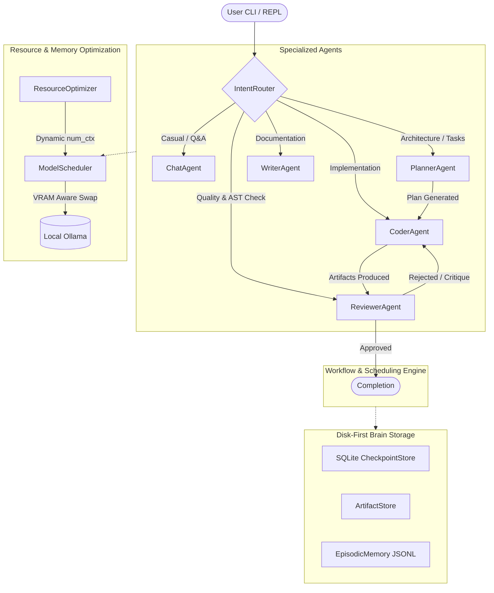

# Aglibol Agent ⚡

<p align="center">
  <strong>An open-source, Ollama-native multi-agent AI framework engineered for personal devices and consumer GPUs.</strong><br>
  Run multi-agent intelligence on 4 GB to 48 GB GPUs with zero cloud API costs and zero Out-Of-Memory crashes.
</p>

<p align="center">
  <a href="https://github.com/Aglibol/AglibolAgent/actions/workflows/ci.yml"></a>
  <a href="https://pypi.org/project/aglibol-agent/"></a>
  <a href="https://www.python.org/downloads/"></a>
  <a href="https://opensource.org/licenses/Apache-2.0"></a>
  <a href="https://github.com/astral-sh/ruff"></a>
  <a href="https://ollama.com/"></a>
  <a href="CONTRIBUTING.md"></a>
</p>

---

## 📜 Table of Contents

- [🌟 Why Aglibol Agent?](#-why-aglibol-agent)
- [🤖 Specialized Roles & AUTO Mode](#-specialized-roles--auto-mode)
- [📊 Hardware Tiers & Automatic Optimization](#-hardware-tiers--automatic-optimization)
- [⚡ Zero-Friction Installation](#-zero-friction-installation)
- [🚀 Quick Start & Interactive REPL](#-quick-start--interactive-repl)
- [🛠️ CLI Commands & Slash Palette](#-cli-commands--slash-palette)
- [🏗️ System Architecture](#-system-architecture)
- [🔒 Security & Sandboxing Architecture](#-security--sandboxing-architecture)
- [🤝 Contributing & Community](#-contributing--community)
- [📚 Citation](#-citation)
- [📄 License](#-license)

---

## 🌟 Why Aglibol Agent?

Most modern multi-agent frameworks (e.g., AutoGen, CrewAI) tacitly assume you have a 24 GB+ enterprise GPU or unlimited cloud API credits. When running multiple 7B+ LLMs locally, VRAM instantly saturates, leading to CUDA Out-Of-Memory (OOM) crashes or severe CPU thrashing.

**Aglibol Agent fundamentally solves local multi-agent constraints:**

- 🎯 **100% Ollama & Local Open Models**: Complete privacy, zero external API costs.
- ⚡ **Dynamic Resource-Aware Profiling**: Continuously inspects GPU VRAM, system RAM, and storage to dynamically adapt context window length (`num_ctx`), quantization tiers, and layer offloading.
- 🔄 **Sequential Model Scheduler**: Sequentially swaps models in and out of GPU memory with `keep_alive: 0` eviction, ensuring VRAM safety even on 4 GB laptop GPUs.
- 💾 **Disk-First Brain Persistence**: Intermediate reasoning, checkpoints, task DAGs, and episodic memories are persisted to disk via SQLite WAL and fast serialization.
- 🛡️ **Defensive Quality Gates**: AST static deadlock detection, syntax verification, and observation masking for small open models (7B–14B).
- 🧩 **Extensible Plugin Ecosystem**: Pluggable agents and tools via `pluggy` and entry points.

---

## 🤖 Specialized Roles & AUTO Mode

Aglibol Agent features 5 specialized agent roles, orchestrated either manually or dynamically in **AUTO Mode** via the `IntentRouter`:

| Role | Default Model | Primary Purpose | Capabilities & Tools |
|:---|:---|:---|:---|
| **CHAT** | `gemma4:e4b` | Interactive dialogue & Q&A | Pure conversational guidance, zero spurious tool invocations |
| **PLANNER** | `ornith-1.5:9b` | Architectural decomposition | Breaks complex goals into verifiable DAG task items |
| **CODER** | `qwen2.5-coder:7b` | Implementation & editing | `write_file`, `search_replace`, `execute_shell`, `list_dir` |
| **REVIEWER** | `qwen2.5-coder:7b` | Quality & security gate | Deterministic AST checks, self-deadlock detection, approval/rejection loop |
| **WRITER** | `glm4:9b` | Documentation & whitepapers | Long-form technical writing, Markdown formatting, document extraction |

In **AUTO Mode**, Aglibol Agent automatically classifies user prompts, routes to the optimal role, and hot-swaps the underlying model in real time.

---

## 📊 Hardware Tiers & Automatic Optimization

Aglibol Agent automatically inspects your machine upon startup and maps your hardware to one of 6 compute tiers:

| Compute Tier | VRAM | System RAM | Representative Hardware | Default Model | Context (`num_ctx`) |
|:---|:---|:---|:---|:---|:---|
| **Tier 1 (Entry)** | 4 GB | 8–16 GB | RTX 3050 Laptop, GTX 1650 | `qwen2.5-coder:7b` / `gemma4:e4b` | 2,048 |
| **Tier 2 (Budget)** | 6 GB | 16 GB | RTX 2060, GTX 1660 Ti | `qwen2.5-coder:7b` | 4,096 |
| **Tier 3 (Mainstream)** | 8 GB | 16–32 GB | RTX 4060, RTX 3060 Ti, RX 7600 | `qwen2.5-coder:7b` / `glm4:9b` | 4,096 |
| **Tier 4 (Performance)** | 10–12 GB | 32 GB | RTX 3060 12GB, RTX 4070 | `qwen2.5-coder:14b` | 8,192 |
| **Tier 5 (Enthusiast)** | 16 GB | 32–64 GB | RTX 4080, RX 7800 XT | `qwen2.5:32b` | 16,384 |
| **Tier 6 (Workstation)**| 24–48 GB | 64 GB+ | RTX 3090 / 4090 / 5090 | `qwen2.5:72b` | 32,768 |

*CPU-Only mode is automatically engaged if no discrete GPU is detected.*

---

## ⚡ Zero-Friction Installation

### Option A: NPX (Zero-installation Node.js wrapper)
```bash
npx aglibol
# or: npx aglibol-agent
```

### Option B: Linux & macOS (Universal Script)
```bash
curl -fsSL https://raw.githubusercontent.com/Aglibol/AglibolAgent/main/install.sh | bash
```

### Option C: Windows PowerShell (Native Script)
```powershell
irm https://raw.githubusercontent.com/Aglibol/AglibolAgent/main/install.ps1 | iex
```

### Option D: Python Package (`pip` / `pipx` / `uvx`)
```bash
pip install aglibol-agent

# or run ephemerally with uvx:
uvx --from aglibol-agent aglibol
```

---

## 🚀 Quick Start & Interactive REPL

### 1. Launch the Interactive REPL
Simply run `aglibol` in your terminal:

```bash
aglibol
```

Inside the interactive REPL:
- **Slash Commands**: Type `/` to open the command palette (`/help`, `/status`, `/model`, `/diff`, `/undo`, `/session`).
- **File Mentions**: Type `@` to fuzzy search and pin workspace files into context (e.g. `@src/main.py`).
- **Live Bottom Toolbar**: Real-time VRAM free, active GPU, resident model, and token budget.
- **Thinking Indicator**: Real-time animated thought process across all agent modes.
- **Time-Travel Undo**: Type `/undo` to atomically rollback changes via SQLite checkpoints.

### 2. Autonomous Non-Interactive Run via CLI
```bash
aglibol run "Build a Token Bucket RateLimiter in rate_limiter.py with unit tests" --select
```

### 3. Check System Health
```bash
aglibol doctor
```

---

## 🛠️ CLI Commands & Slash Palette

### CLI Commands
| Command | Description |
|:---|:---|
| `aglibol` / `aglibol chat` | Launch interactive developer REPL |
| `aglibol run "<goal>"` | Execute autonomous task pipeline (`Planner ➔ Coder ➔ Reviewer`) |
| `aglibol resume <session_id>` | Resume an interrupted or saved session from the exact last step |
| `aglibol doctor` | Run comprehensive system, GPU, Ollama, and tool diagnostics |
| `aglibol models [list\|bind\|select]`| Inspect installed models, check offload feasibility, bind roles |
| `aglibol status` | Inspect active Ollama endpoint, resident models, and Brain disk usage |
| `aglibol brain [list\|delete\|prune]` | Manage persistent sessions, inspect checkpoints, prune ghost sessions |
| `aglibol update` | Check GitHub for new versions and self-upgrade |

### Interactive Slash Commands (`/`)
| Slash Command | Action |
|:---|:---|
| `/help` | Display interactive cheat sheet |
| `/session` | Open graphical Session Hub (resume, delete, prune, list) |
| `/model [role] [model]` | Hot-swap active model or open graphical role model selector |
| `/mode [auto\|chat\|coder\|...]` | Switch agent mode |
| `/safety [strict\|balanced\|autonomous]` | Toggle Human-in-the-Loop safety gate |
| `/context` | Display visual token budget bar and pinned file inspector |
| `/diff` | Render colored git diff of agent modifications |
| `/undo` | Rollback workspace artifacts to the prior checkpoint step |
| `/commit [message]` | Stage and commit workspace changes via Git |
| `/doctor` / `/status` / `/update` | Execute system utilities directly inside REPL |
| `/exit` | Cleanly unload resident GPU models and exit |

---

## 🏗️ System Architecture



---

## 🔒 Security & Sandboxing Architecture

Because Aglibol Agent executes local tools and commands, security is foundational to its architecture:

1. **Workspace Sandboxing**: All file tools (`read_file`, `write_file`, `search_replace`, `list_dir`) strictly validate paths against the workspace boundary. Symlink traversals and `..` escape attempts are blocked.
2. **Command Pattern Guard**: The shell execution tool blocks catastrophic system commands (`rm -rf /`, `mkfs`, fork bombs, raw drive formatting).
3. **Subprocess Process Tree Isolation**: On Windows and POSIX, timed-out or cancelled processes are terminated cleanly across their entire process tree (preventing orphaned zombie processes).
4. **Environment Token Scrubbing**: Sensitive API keys and tokens (`AWS_SECRET_ACCESS_KEY`, `GITHUB_TOKEN`, `OPENAI_API_KEY`, etc.) are stripped from subprocess environments with case-insensitive normalization.
5. **Human-in-the-Loop (HITL) Safety Gate**: Choose between `strict` (prompts for every file modification and command), `balanced` (prompts for destructive tools and sensitive files), or `autonomous`.
6. **AST Static Code Gate**: Code generated by LLMs is deterministically checked for syntax validity and self-deadlock patterns before touching production workflows.

---

## 🤝 Contributing & Community

Contributions are warmly welcomed! We are committed to building an inclusive and open ecosystem:

- 📖 Read our [Contributing Guide](CONTRIBUTING.md) for local setup, testing, and PR conventions.
- 📜 Adhere to our [Code of Conduct](CODE_OF_CONDUCT.md).
- 🔒 For security vulnerabilities, review our [Security Policy](SECURITY.md).
- 📝 See [CHANGELOG.md](CHANGELOG.md) for historical release notes.

---

## 📚 Citation

If you use Aglibol Agent in your academic research or industry project, please cite:

```bibtex
@software{aglibol_agent_2026,
  author = {Aglibol Agent Contributors},
  title = {Aglibol Agent: An Open-Source Ollama-Native Multi-Agent Framework for Personal Devices},
  year = {2026},
  publisher = {GitHub},
  journal = {GitHub repository},
  howpublished = {\url{https://github.com/Aglibol/AglibolAgent}},
  license = {Apache-2.0}
}
```

---

## 📄 License

Aglibol Agent is open-source software licensed under the [Apache-2.0 License](LICENSE).
