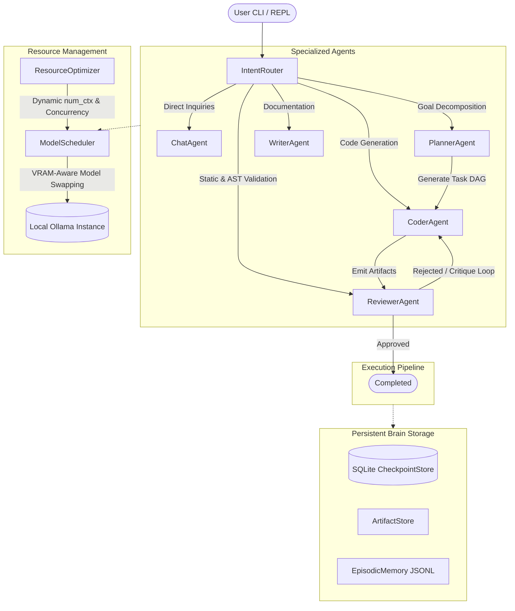

# Aglibol Agent

An open-source, Ollama-native multi-agent framework engineered for personal devices and consumer GPUs.

Run cooperative multi-agent workflows locally on 4 GB to 48 GB GPUs with zero cloud API costs, complete data privacy, and zero Out-Of-Memory crashes.

[](https://github.com/xushiexpresso15/AglibolAgent/actions/workflows/ci.yml)
[](https://github.com/xushiexpresso15/AglibolAgent/actions/workflows/scorecard.yml)
[](https://github.com/xushiexpresso15/AglibolAgent/actions/workflows/codeql.yml)
[](https://pypi.org/project/aglibol-agent/)
[](https://www.python.org/downloads/)
[](https://opensource.org/licenses/Apache-2.0)
[](https://github.com/astral-sh/ruff)
[](CONTRIBUTING.md)

---

## Table of Contents

- [Overview](#overview)
- [Key Capabilities](#key-capabilities)
- [Architecture](#architecture)
- [Agent Roles and Autonomous Routing](#agent-roles-and-autonomous-routing)
- [Hardware Profiles and Adaptive Scheduling](#hardware-profiles-and-adaptive-scheduling)
- [Installation](#installation)
- [Uninstallation](#uninstallation)
- [Quick Start](#quick-start)
- [Command-Line Interface](#command-line-interface)
- [Security and Sandboxing](#security-and-sandboxing)
- [Contributing](#contributing)
- [Citation](#citation)
- [License](#license)

---

## Overview

Existing multi-agent frameworks often assume access to high-end enterprise clusters (such as multi-A100 or H100 setups) or rely heavily on third-party commercial APIs. Running multiple 7B to 14B parameter models concurrently on consumer hardware frequently saturates GPU VRAM, leading to CUDA Out-Of-Memory (OOM) aborts, process termination, or severe disk swapping.

Aglibol Agent addresses these constraints through local resource-aware scheduling:

- **Resource-Aware Scheduling**: Dynamically tracks available VRAM and system memory before loading weights or dispatching inference calls.
- **Sequential Model Residency**: Manages model transitions using explicit lifecycle hooks and `keep_alive` controls, enabling multi-agent handoffs even on 4 GB laptop GPUs.
- **Deterministic Guardrails**: Protects small models (7B–14B) from instruction drift and malformed outputs through AST syntax validation, observation masking, and structured output schemas.
- **Local Persistence**: Maintains intermediate checkpoints, task dependency graphs (DAGs), and conversation state using SQLite with Write-Ahead Logging (WAL) and streaming JSONL logs.

---

## Key Capabilities

- **100% Local Inference**: Integrates directly with Ollama. Operates completely offline with zero telemetry, data leakage, or token metering fees.
- **Dynamic Context and Quantization Scaling**: Automatically measures hardware specifications and adjusts context window sizes (`num_ctx`), quantization tiers, and layer offloading dynamically.
- **Pluggable Architecture**: Built on top of `pluggy` and standard Python entry points, allowing developers to register custom agents, tools, and execution strategies.
- **Resilient Tool Execution**: Provides sandboxed file system operations, fuzzy search-and-replace, and shell execution with process-tree cleanup.
- **Interactive Terminal Interface**: Features a full-featured terminal UI with slash commands, file pinning via `@` mentions, real-time token telemetry, and checkpoint-based state rollback.

---

## Architecture

The system coordinates specialized agent roles through a sequential scheduling and state management pipeline:



---

## Agent Roles and Autonomous Routing

Aglibol Agent implements specialized agents tailored for smaller open-weight models. In **AUTO Mode**, the `IntentRouter` classifies user intent and selects the optimal agent role:

| Role | Default Model | Responsibility | Available Tools |
|:---|:---|:---|:---|
| **CHAT** | `gemma4:e4b` | General conversation, clarifications, and explanations | Conversational context, zero file mutations |
| **PLANNER** | `ornith-1.5:9b` | Architectural decomposition and verifiable DAG task breakdown | Read-only workspace inspection |
| **CODER** | `qwen2.5-coder:7b` | Implementation, refactoring, and code repair | `read_file`, `write_file`, `search_replace`, `execute_shell`, `list_dir` |
| **REVIEWER** | `qwen2.5-coder:7b` | Code review, AST syntax verification, and execution analysis | AST parsing, syntax validation, test runners |
| **WRITER** | `glm4:9b` | Technical documentation, user manuals, and specifications | `read_file`, `write_file`, document extraction |

---

## Hardware Profiles and Adaptive Scheduling

During startup, the system probes the local host (CPU, RAM, GPU vendor, VRAM, and platform) and assigns the machine to one of six resource tiers:

| Tier | Dedicated VRAM | System RAM | Representative Hardware | Default Model | Context Window (`num_ctx`) |
|:---|:---|:---|:---|:---|:---|
| **Tier 1 (Entry)** | 4 GB | 8–16 GB | GTX 1650, RTX 3050 Laptop | `qwen2.5-coder:7b` / `gemma4:e4b` | 2,048 |
| **Tier 2 (Budget)** | 6 GB | 16 GB | GTX 1660 Ti, RTX 2060 | `qwen2.5-coder:7b` | 4,096 |
| **Tier 3 (Mainstream)** | 8 GB | 16–32 GB | RTX 3060 Ti, RTX 4060, RX 7600 | `qwen2.5-coder:7b` / `glm4:9b` | 4,096 |
| **Tier 4 (Performance)** | 10–12 GB | 32 GB | RTX 3060 12GB, RTX 4070 | `qwen2.5-coder:14b` | 8,192 |
| **Tier 5 (Enthusiast)** | 16 GB | 32–64 GB | RTX 4080, RX 7800 XT | `qwen2.5:32b` | 16,384 |
| **Tier 6 (Workstation)**| 24–48 GB | 64 GB+ | RTX 3090, RTX 4090, RTX 5090 | `qwen2.5:72b` | 32,768 |

*Note: If no discrete GPU is found, the system engages CPU-Only mode with adjusted quantization profiles.*

---

## Installation

### Method 1: NPX (No Local Installation Required)

```bash
npx aglibol
# or
npx aglibol-agent
```

### Method 2: Python Package (pip / pipx / uv)

```bash
pip install aglibol-agent

# Alternatively, run via uvx:
uvx --from aglibol-agent aglibol
```

### Method 3: Linux and macOS (Automated Script)

```bash
curl -fsSL https://raw.githubusercontent.com/xushiexpresso15/AglibolAgent/main/install.sh | bash
```

### Method 4: Windows PowerShell (Automated Script)

```powershell
irm https://raw.githubusercontent.com/xushiexpresso15/AglibolAgent/main/install.ps1 | iex
```

---

## Uninstallation

### Method 1: Linux and macOS (Automated Script)

```bash
curl -fsSL https://raw.githubusercontent.com/xushiexpresso15/AglibolAgent/main/uninstall.sh | bash

# To completely purge all stored sessions, checkpoints, and cache:
curl -fsSL https://raw.githubusercontent.com/xushiexpresso15/AglibolAgent/main/uninstall.sh | bash -s -- --purge
```

### Method 2: Windows PowerShell (Automated Script)

```powershell
irm https://raw.githubusercontent.com/xushiexpresso15/AglibolAgent/main/uninstall.ps1 | iex

# To completely purge all stored sessions, checkpoints, and cache:
& ([scriptblock]::Create((irm https://raw.githubusercontent.com/xushiexpresso15/AglibolAgent/main/uninstall.ps1))) -Purge
```

### Method 3: Python Package Managers

```bash
# If installed via uv:
uv tool uninstall aglibol-agent

# If installed via pip:
pip uninstall aglibol-agent

# If installed via pipx:
pipx uninstall aglibol-agent
```

### Cleaning Up Persistent Data Manually

To manually remove local cache, checkpoints, and session history:
- Linux / macOS: `rm -rf ~/.aglibol`
- Windows PowerShell: `Remove-Item -Recurse -Force "$HOME\.aglibol"`

---

## Quick Start

### 1. Launch the Interactive REPL

Run `aglibol` in any project directory:

```bash
aglibol
```

Inside the interactive REPL:
- **Slash Commands**: Type `/` to open command options (`/help`, `/model`, `/diff`, `/undo`, `/session`).
- **File Mentions**: Type `@` to select and pin workspace files into context (e.g., `@src/core.py`).
- **Telemetry Bar**: Displays active VRAM headroom, resident model, and token budget.
- **State Rollback**: Type `/undo` to revert file modifications to the previous checkpoint.

### 2. Autonomous Task Pipeline

Execute non-interactive multi-agent workflows from the command line:

```bash
aglibol run "Implement a TokenBucket rate limiter in rate_limiter.py with unit tests" --select
```

### 3. Verify System Health

Run diagnostic checks against local runtime dependencies:

```bash
aglibol doctor
```

---

## Command-Line Interface

### Commands

| Command | Purpose |
|:---|:---|
| `aglibol` / `aglibol chat` | Launch the interactive developer REPL |
| `aglibol run "<goal>"` | Execute an autonomous multi-agent task pipeline |
| `aglibol resume <session_id>` | Resume a previous session from its stored checkpoint |
| `aglibol doctor` | Run environment, GPU, Ollama, and system diagnostics |
| `aglibol models [list\|bind\|select]` | Query local models, check VRAM offload feasibility, and configure role bindings |
| `aglibol status` | Inspect Ollama service connection, active model residency, and storage metrics |
| `aglibol brain [list\|delete\|prune]` | Manage persistent sessions and remove orphaned checkpoints |
| `aglibol update` | Check GitHub for upstream updates and self-upgrade |

### Interactive Slash Commands

| Slash Command | Action |
|:---|:---|
| `/help` | Display reference guide for interactive commands |
| `/session` | Open the interactive session management hub |
| `/model [role] [model]` | Reassign or hot-swap model bindings |
| `/mode [auto\|chat\|coder\|...]` | Switch the active agent execution mode |
| `/safety [strict\|balanced\|autonomous]` | Adjust the Human-in-the-Loop approval gate |
| `/context` | Display token consumption metrics and pinned files |
| `/diff` | Inspect Git diff of agent modifications |
| `/undo` | Roll back workspace artifacts to the previous checkpoint |
| `/commit [message]` | Stage and commit workspace changes via Git |
| `/exit` | Cleanly release resident models from GPU memory and exit |

---

## Security and Sandboxing

Because Aglibol Agent executes local tools and commands, security is foundational to its architecture:

1. **Workspace Sandboxing**: File operations (`read_file`, `write_file`, `search_replace`, `list_dir`) are strictly scoped to the workspace directory. Symlink resolution and directory traversal (`..`) attempts outside the workspace boundary are rejected.
2. **Command Pattern Guard**: The shell execution tool blocks catastrophic command patterns (`rm -rf /`, `mkfs`, fork bombs, raw drive formatting).
3. **Process Tree Lifecycle**: On both Windows and POSIX systems, timed-out or cancelled processes are terminated across their entire process hierarchy to prevent orphaned subprocesses.
4. **Environment Variable Scrubbing**: Sensitive credentials (`AWS_SECRET_ACCESS_KEY`, `GITHUB_TOKEN`, `OPENAI_API_KEY`, etc.) are stripped from child process environments using case-insensitive matching.
5. **Human-in-the-Loop (HITL) Gate**: Configurable safety modes (`strict`, `balanced`, `autonomous`) enforce confirmation before mutating files or running terminal commands.
6. **AST Static Code Verification**: Code emitted by language models is validated for syntax validity and import sanity before integration into production workflows.

---

## Contributing

Contributions are welcome. Please consult the following resources:

- [Contributing Guide](CONTRIBUTING.md): Setup instructions, test guidelines, and coding standards.
- [Code of Conduct](CODE_OF_CONDUCT.md): Community engagement standards.
- [Security Policy](SECURITY.md): Vulnerability reporting procedures.
- [Changelog](CHANGELOG.md): Historical record of changes across versions.

---

## Citation

If you use Aglibol Agent in your academic research or technical publications, please cite the project:

```bibtex
@software{aglibol_agent_2026,
  author = {Aglibol Agent Contributors},
  title = {Aglibol Agent: An Open-Source Ollama-Native Multi-Agent Framework for Personal Devices},
  year = {2026},
  publisher = {GitHub},
  journal = {GitHub repository},
  howpublished = {\url{https://github.com/xushiexpresso15/AglibolAgent}},
  license = {Apache-2.0}
}
```

---

## License

Aglibol Agent is distributed under the [Apache-2.0 License](LICENSE).
